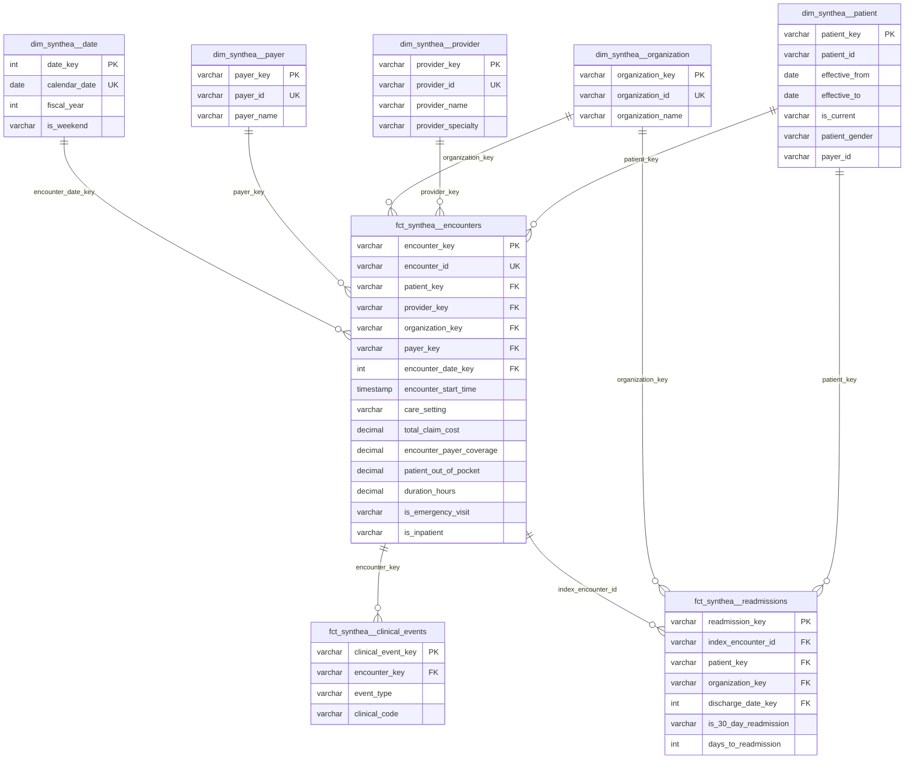

# Synthea Healthcare Warehouse

[](https://www.getdbt.com/)
[](https://www.snowflake.com/)
[](LICENSE)

## Documentation

| Document | Description |
|----------|-------------|
| **[docs/PROJECT_GUIDE.md](docs/PROJECT_GUIDE.md)** | **Full reference:** every model, column transformations, every test, all dbt commands |
| [README.md](README.md) | Overview, setup, architecture summary |

## Table of Contents

- [Project Overview](#-project-overview)
- [Repository Structure](#-repository-structure)
- [Data Model Architecture](#-data-model-architecture)
- [Entity Relationship Diagram](#-entity-relationship-diagram)
- [Getting Started](#-getting-started)
- [Model Documentation](#-model-documentation)
- [Semantic Layer](#-semantic-layer)
- [Data Quality & Testing](#-data-quality--testing)
- [Key Business Metrics](#-key-business-metrics)
- [Important Notes & Data Caveats](#-important-notes--data-caveats)
- [Deployment](#-deployment)
- [Utility Scripts](#-utility-scripts)
- [Contributing](#-contributing)

---

## Project Overview

This dbt project transforms [Synthea](https://github.com/synthetichealth/synthea) synthetic healthcare data into a production-style analytics warehouse on **Snowflake**. It implements Kimball-style dimensional modeling, pre-built reporting tables, and a dbt Semantic Layer for self-serve BI.

### Key Features

- **Dimensional Modeling**: Star schema with fact and dimension tables
- **SCD Type 2 Patients**: Insurance-period grain with effective dating
- **Readmission Analytics**: 7/30/90-day readmission flags and quality metrics
- **Reporting Layer**: Pre-aggregated tables for dashboards and KPIs
- **Semantic Layer**: MetricFlow metrics with ratio KPIs (readmission rate, ED utilization, cost burden)
- **Data Quality**: 210+ tests with automated audit logging to Snowflake
- **Strict Mart Cleaning**: Non-negative costs and duration bounds enforced at the fact layer

### Snowflake Layout

| Schema | dbt Layer | Materialization |
|--------|-----------|-----------------|
| `RAW` | Sources only (not built by dbt) | — |
| `STAGING` | `models/staging/` | View |
| `INTERMEDIATE` | `models/intermediate/` | View |
| `MARTS` | `models/marts/` | Table |
| `REPORTING` | `models/reporting/` | Table |

---

## Repository Structure

```
synthea-healthcare-warehouse/
│
├── macros/
│   ├── admin/
│   │   └── truncate_non_raw_tables.sql       # Truncate all non-RAW tables
│   ├── generate_schema_name.sql              # Maps layers to Snowflake schemas
│   ├── log_test_results.sql                  # Writes test results to audit table
│   ├── synthea_staging_columns.sql           # Date parsing, Yes/No, address helpers
│   └── synthea_surrogate_keys.sql            # MD5 surrogate keys and date keys
│
├── models/
│   ├── staging/synthea/
│   │   ├── _synthea__sources.yml             # RAW source definitions
│   │   ├── _synthea__models.yml              # Staging contracts and tests
│   │   └── stg_synthea__*.sql                # 9 staging models
│   │
│   ├── intermediate/synthea/
│   │   ├── _int_synthea__models.yml
│   │   ├── int_synthea__patient_insurance_periods.sql
│   │   ├── int_synthea__encounter_enriched.sql
│   │   └── int_synthea__readmission_flags.sql
│   │
│   ├── marts/synthea/
│   │   ├── _marts__models.yml
│   │   ├── dimensions/
│   │   │   ├── dim_synthea__date.sql
│   │   │   ├── dim_synthea__patient.sql
│   │   │   ├── dim_synthea__provider.sql
│   │   │   ├── dim_synthea__organization.sql
│   │   │   └── dim_synthea__payer.sql
│   │   └── facts/
│   │       ├── fct_synthea__encounters.sql
│   │       ├── fct_synthea__readmissions.sql
│   │       └── fct_synthea__clinical_events.sql
│   │
│   ├── reporting/synthea/
│   │   ├── _reporting__models.yml
│   │   ├── rpt_synthea__monthly_encounters.sql
│   │   ├── rpt_synthea__readmission_rate_monthly.sql
│   │   ├── rpt_synthea__cost_of_care_annual.sql
│   │   ├── rpt_synthea__provider_performance.sql
│   │   └── rpt_synthea__high_risk_patients.sql
│   │
│   └── semantic/
│       └── metrics.yml                       # Semantic models and metrics (YAML only)
│
├── tests/
│   ├── staging/                              # 5 custom data tests
│   ├── intermediate/                         # 7 custom data tests
│   ├── marts/                                # 2 custom data tests
│   └── reporting/                            # 1 custom data test
│
├── scripts/
│   ├── check_test_audit_log.py               # Latest test audit rows
│   ├── check_test_audit_log_stages.py        # Audit summary by stage
│   ├── check_reporting_counts.py             # Reporting table row counts
│   └── migrate_test_audit_table.py           # One-off audit table migration
│
├── dbt_project.yml
├── packages.yml                              # dbt_utils
└── profiles.yml.example
```

---

## Data Model Architecture

### Dimensional Model Design

The model follows **Kimball methodology** with a healthcare star schema:

#### Fact Tables

| Model | Grain | Description |
|-------|-------|-------------|
| `fct_synthea__encounters` | One row per encounter | Costs, duration, care setting, payer coverage |
| `fct_synthea__readmissions` | One row per index discharge | 7/30/90-day readmission flags |
| `fct_synthea__clinical_events` | One row per clinical event | Union of conditions, procedures, medications |

#### Dimension Tables

| Model | Grain | Description |
|-------|-------|-------------|
| `dim_synthea__patient` | One row per insurance period (SCD2) | Demographics, payer, effective dates |
| `dim_synthea__provider` | One row per provider | Specialty, address, utilization |
| `dim_synthea__organization` | One row per organization | Facility details |
| `dim_synthea__payer` | One row per payer | Insurance company details |
| `dim_synthea__date` | One row per calendar day | Fiscal calendar, MetricFlow time spine |

### Data Flow

```
RAW (Synthea CSVs)
  → Staging (clean, standardize, Yes/No flags)
    → Intermediate (SCD2 insurance periods, encounter enrichment, readmission logic)
      → Marts (dimensions + facts)
        → Reporting (pre-aggregated KPIs)
          → Semantic Layer (metrics for BI tools)
```

### Naming Conventions

All models use entity-prefixed naming:

- `stg_synthea__*` — staging
- `int_synthea__*` — intermediate
- `dim_synthea__*` / `fct_synthea__*` — marts
- `rpt_synthea__*` — reporting

---

## Entity Relationship Diagram



---

## Getting Started

### Prerequisites

- **Python 3.10+**
- **dbt Core 1.12+** with **Snowflake** adapter
- **Snowflake** account with `SYNTHEA_WAREHOUSE` database
- Raw Synthea tables loaded into `SYNTHEA_WAREHOUSE.RAW`

### Installation

1. **Clone the repository:**

```bash
git clone <your-repo-url>
cd synthea-healthcare-warehouse
```

2. **Install dbt and dependencies:**

```bash
pip install dbt-core dbt-snowflake
dbt deps
```

3. **Configure your profile** — copy `profiles.yml.example` to `~/.dbt/profiles.yml`:

```yaml
synthea_healthcare_warehouse:
  target: dev
  outputs:
    dev:
      type: snowflake
      account: your-account
      user: your-user
      password: "{{ env_var('SNOWFLAKE_PASSWORD') }}"
      role: your-role
      database: SYNTHEA_WAREHOUSE
      warehouse: "{{ env_var('SNOWFLAKE_WAREHOUSE', 'COMPUTE_WH') }}"
      schema: STAGING
      threads: 4
```

4. **Set environment variables:**

```bash
export SNOWFLAKE_PASSWORD=your-password
export SNOWFLAKE_WAREHOUSE=COMPUTE_WH   # optional
```

### Quick Start

```bash
# Verify connection
dbt debug

# Install packages
dbt deps

# Full build (models + tests)
dbt build

# Generate and view documentation
dbt docs generate
dbt docs serve
```

### Layer-by-Layer Build

```bash
dbt run --select path:models/staging
dbt run --select path:models/intermediate
dbt run --select path:models/marts
dbt run --select path:models/reporting
dbt test
```

### Full Rebuild from RAW

```bash
# Truncate all non-RAW tables, then rebuild
dbt run-operation truncate_non_raw_tables
dbt build
```

---

## Model Documentation

### Staging Models

| Model | Source | Purpose |
|-------|--------|---------|
| `stg_synthea__patients` | `RAW.PATIENTS` | Demographics, address, identifiers |
| `stg_synthea__encounters` | `RAW.ENCOUNTERS` | Visits with cost, duration, care setting |
| `stg_synthea__conditions` | `RAW.CONDITIONS` | Diagnoses linked to encounters |
| `stg_synthea__medications` | `RAW.MEDICATIONS` | Prescriptions with start/stop dates |
| `stg_synthea__procedures` | `RAW.PROCEDURES` | Clinical procedures |
| `stg_synthea__providers` | `RAW.PROVIDERS` | Clinician details |
| `stg_synthea__organizations` | `RAW.ORGANIZATIONS` | Facility details |
| `stg_synthea__payers` | `RAW.PAYERS` | Insurance company details |
| `stg_synthea__payer_transitions` | `RAW.PAYER_TRANSITIONS` | Coverage period changes |

**Key transformations:** date/timestamp parsing, Yes/No flags, entity-prefixed column names, surrogate key prep.

### Intermediate Models

| Model | Grain | Purpose |
|-------|-------|---------|
| `int_synthea__patient_insurance_periods` | Patient × coverage period | SCD2 prep with `effective_from` / `effective_to` |
| `int_synthea__encounter_enriched` | One row per encounter | Duration, care setting, cost breakdown |
| `int_synthea__readmission_flags` | One row per index discharge | 7/30/90-day readmission detection |

### Reporting Models

| Model | Grain | Purpose |
|-------|-------|---------|
| `rpt_synthea__monthly_encounters` | Month × care setting × payer | Encounter volume trends |
| `rpt_synthea__readmission_rate_monthly` | Month × diagnosis × payer | 30-day readmission rate with quality flags |
| `rpt_synthea__cost_of_care_annual` | Patient × fiscal year | Annual cost segmentation |
| `rpt_synthea__provider_performance` | Provider | Volume, cost, readmission scorecard |
| `rpt_synthea__high_risk_patients` | Patient | Care management outreach list |

---

## Semantic Layer

Semantic models and metrics are defined in `models/semantic/metrics.yml`. `dim_synthea__date` is configured as the MetricFlow time spine.

### Semantic Models

| Name | Source | Grain |
|------|--------|-------|
| `encounters` | `fct_synthea__encounters` | One row per encounter |
| `readmissions` | `fct_synthea__readmissions` | One row per index discharge |
| `patients` | `dim_synthea__patient` | One row per insurance period (SCD2) |
| `providers` | `dim_synthea__provider` | One row per provider |
| `payers` | `dim_synthea__payer` | One row per payer |
| `organizations` | `dim_synthea__organization` | One row per organization |

### Key Metrics

| Metric | Type | Description |
|--------|------|-------------|
| `total_encounters` | Simple | Total patient encounters |
| `readmission_rate_30day` | Ratio | 30-day readmission rate (quality KPI) |
| `ed_utilization_rate` | Ratio | Emergency department visit share |
| `avg_cost_per_encounter` | Simple | Average cost per visit |
| `patient_cost_burden` | Ratio | Out-of-pocket share of total cost |
| `insurance_coverage_rate` | Ratio | Payer coverage share of total cost |
| `inpatient_admission_rate` | Ratio | Inpatient admission share |

Metric descriptions include search-term aliases for BI discoverability (native `synonyms:` not supported in dbt 1.12 legacy YAML).

```bash
dbt parse   # validates semantic manifest
```

---

## Data Quality & Testing

### Test Coverage

| Layer | Schema Tests | Custom SQL Tests |
|-------|-------------|------------------|
| Staging | Column contracts in `_synthea__models.yml` | 5 (costs, temporal, utilization) |
| Intermediate | Column tests in `_int_synthea__models.yml` | 7 (SCD2, readmissions, temporal) |
| Marts | Relationships, accepted values | 2 (cost/duration, readmission links) |
| Reporting | Expression tests, accepted values | 1 (readmission rate bounds) |

**Total: ~210 tests** across schema and custom tests.

### Automated Audit Logging

Every test run is logged to `REPORTING.DBT_TEST_RESULTS` via the `on-run-end` hook (`log_test_results` macro). Each row captures:

- Test name, status, failures, execution time
- Target model and resource path
- **`model_layer`**: staging | intermediate | marts | reporting
- **`target_model_schema`**: actual Snowflake schema (`MARTS`, `REPORTING`, etc.)
- **`schema_name`**: same as `target_model_schema` (not the dbt profile default `STAGING`)
- Invocation ID for grouping by run

```sql
-- Tests by layer (latest run)
select model_layer, status, count(*) as n
from reporting.dbt_test_results
where invocation_id = (
  select invocation_id from reporting.dbt_test_results
  order by logged_at desc limit 1
)
group by 1, 2
order by 1, 2;
```

```bash
# View latest audit summary by stage
python scripts/check_test_audit_log_stages.py
```

### Running Tests

```bash
# All tests
dbt test

# By layer
dbt test --select path:tests/staging
dbt test --select path:tests/intermediate
dbt test --select path:tests/marts
dbt test --select path:tests/reporting

# Schema tests only
dbt test --select test_type:generic

# Custom tests only
dbt test --select test_type:data
```

### Known Test Status

| Test | Status | Cause |
|------|--------|-------|
| `test_stg_medications_temporal_consistency` | **Fail** (5 rows) | Synthea source: `stopped_at < started_at` |
| `relationships_fct_synthea__encounters_patient_key` | **Warn** (~29k rows) | Encounter date outside insurance period |
| `relationships_fct_synthea__readmissions_patient_key` | **Warn** (~902 rows) | Same insurance period mismatch |

---

## Key Business Metrics

### Quality Metrics

- **30-Day Readmission Rate**: Primary quality KPI; industry benchmark < 15%
- **ED Utilization Rate**: Emergency department visit share; high rates may indicate primary care gaps
- **Avg Days to Readmission**: Timing analysis for discharged patients

### Cost Metrics

- **Total Healthcare Cost**: Sum of encounter claim costs
- **Patient Cost Burden**: Out-of-pocket share of total spend
- **Insurance Coverage Rate**: Payer reimbursement share
- **Cost of Care by Patient/Fiscal Year**: Annual segmentation (High/Medium/Low)

### Utilization Metrics

- **Monthly Encounters by Care Setting**: Ambulatory, inpatient, emergency, urgent care, wellness
- **Provider Performance Scorecard**: Volume, cost, readmission flags per provider
- **High-Risk Patient List**: Recent readmissions, frequent ED use, high cost, chronic conditions

---

## Important Notes & Data Caveats

Read these before presenting metrics to stakeholders or using numbers as "real" healthcare analytics.

### Synthea Is Synthetic Data

- **~49% 30-day readmission rate** in this dataset vs. ~15% real-world benchmark. Logic is correct; the synthetic generator produces unrealistic rates.
- **5 medication rows** have `stopped_at < started_at` in source data (known failing test).

### Patient Dimension (SCD2)

- `dim_synthea__patient` is **one row per insurance period**, not per patient.
- Use `count_distinct patient_id` for census-style patient counts.
- **All `is_current = 'No'`** in Synthea — coverage periods are historical. Reports use the **latest period per patient**, not `is_current = 'Yes'`.

### Insurance Period Matching

- Many encounters fall outside any insurance coverage window → null/warn `patient_key` on facts (~29k encounters, ~902 readmissions). This is expected with Synthea date ranges.

### Mart-Level Data Cleaning

`fct_synthea__encounters` enforces strict bounds:

- Negative costs clamped to `0` via `greatest(..., 0)`
- `duration_hours < 0` → `0`; `duration_hours > 1000` → `null`

Document this if analysts drill to row-level detail.

### Readmissions and Payers

- `fct_synthea__readmissions` has **no `payer_key`**. For payer-level readmission analysis, join through `fct_synthea__encounters` on `index_encounter_id = encounter_id`.

### Credentials

- `profiles.yml` is local and **not committed**. Use `SNOWFLAKE_PASSWORD` env var (see `profiles.yml.example`).

---

## Deployment

### Environment Strategy

| Target | Purpose |
|--------|---------|
| `dev` | Local development and testing |
| `staging` | Pre-production validation (configure in `profiles.yml`) |
| `prod` | Production BI environment |

### Deployment Commands

```bash
# Standard deploy
dbt build --target prod

# Full refresh (recreate all tables)
dbt run --full-refresh --target prod

# Daily tag only
dbt run --select tag:daily

# Truncate and rebuild everything except RAW
dbt run-operation truncate_non_raw_tables
dbt build
```

---

## Utility Scripts

| Script | Purpose |
|--------|---------|
| `scripts/check_test_audit_log.py` | Latest 10 rows from `DBT_TEST_RESULTS` |
| `scripts/check_test_audit_log_stages.py` | Test counts by stage for latest invocation |
| `scripts/check_reporting_counts.py` | Row counts for all reporting tables |
| `scripts/migrate_test_audit_table.py` | Add metadata columns to audit table |

All scripts require `SNOWFLAKE_PASSWORD` environment variable.

---

## Contributing

### Development Workflow

1. Fork the repository
2. Create a feature branch: `git checkout -b feature/new-model`
3. Make changes and test: `dbt build`
4. Update documentation in `_models.yml` files
5. Submit a pull request

### Code Standards

- **Naming**: `stg_synthea__*`, `int_synthea__*`, `dim_synthea__*`, `fct_synthea__*`, `rpt_synthea__*`
- **Flags**: Use `'Yes'` / `'No'` strings (not 0/1 integers)
- **Surrogate keys**: Use `synthea_surrogate_key()` and `synthea_date_key()` macros
- **Tests**: Add schema tests in YAML + custom SQL tests in `tests/` for business logic
- **Documentation**: All models must have descriptions in `_models.yml`

### Example Model Structure

```sql
{{
    config(
        tags=['daily']
    )
}}

with source_data as (

    select * from {{ ref('int_synthea__encounter_enriched') }}

),

final as (

    select
        {{ synthea_surrogate_key(['encounter_id']) }} as encounter_key,
        encounter_id,
        greatest(total_claim_cost, 0) as total_claim_cost,
        {{ dbt.current_timestamp_backcompat() }}::timestamp_ntz as dbt_loaded_at
    from source_data

)

select * from final
```

---

## Acknowledgments

- [dbt Labs](https://www.getdbt.com/) for the transformation framework and Semantic Layer
- [Synthea](https://github.com/synthetichealth/synthea) for synthetic healthcare data
- [Kimball Group](https://www.kimballgroup.com/) for dimensional modeling methodology
